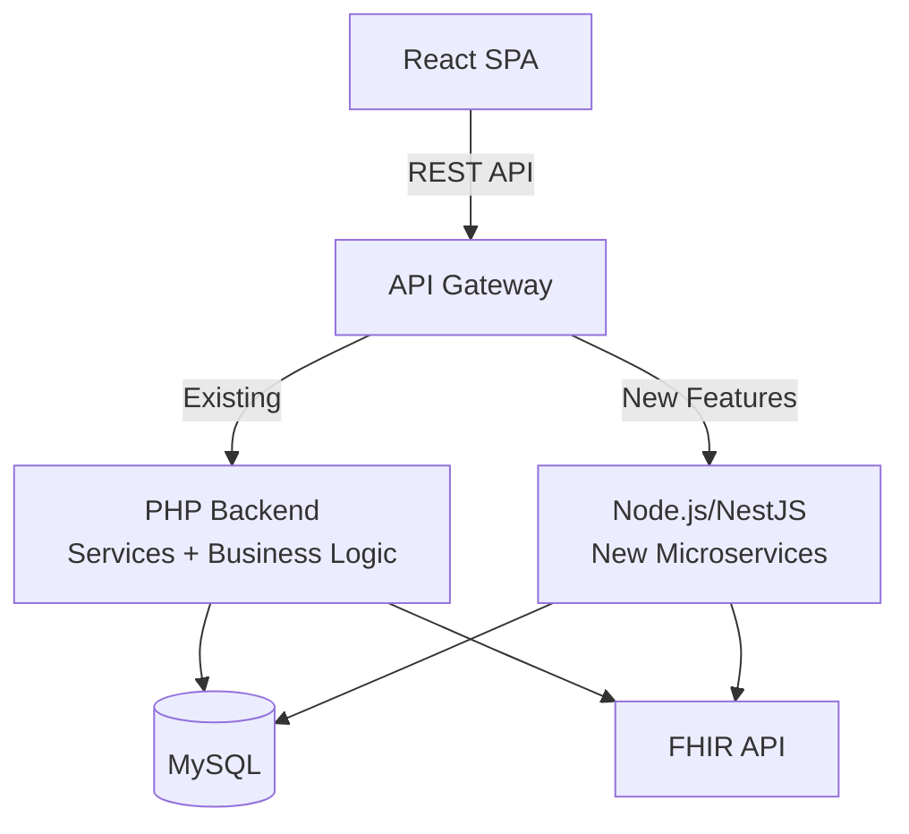

# Backend Replacement Analysis

## Decommissioning PHP — Feasibility & Effort Assessment

---

## 1. What the PHP Backend Does

The PHP backend is not just an API layer — it is the **entire application**. These are the responsibilities it handles:

### 1.1 REST API Layer (Already Separated)
| Directory | Files | Lines | Status for Replacement |
|-----------|-------|-------|----------------------|
| `apis/routes/` | 3 route files | ~2,100 lines | Easy — these are thin route definitions |
| `src/RestControllers/` | ~50 controllers | ~8,000+ lines | Medium — need porting to new language |
| `src/Services/` | ~80 services | ~15,000+ lines | **Hard** — contains all business logic |
| `src/Entities/` | ~60 entity classes | ~3,000+ lines | Medium — ORM entity definitions |

### 1.2 Business Logic (Hardest to Replace)
| Area | Complexity | Description |
|------|-----------|-------------|
| **Patient management** | High | Demographics, merge, duplicate detection, portal auth |
| **Clinical data** | High | Encounters, SOAP notes, vitals, problems, allergies, meds |
| **Billing/claims** | **Very High** | HCFA 1500, ERA parsing, payment gateways, insurance processing |
| **Appointment scheduling** | Medium | Calendar, conflicts, reminders, flow board |
| **Lab interfaces** | High | HL7 integration, procedure results |
| **CDA/CCD documents** | High | XML generation, template parsing, CCDA export |
| **FHIR API** | **Very High** | 30+ FHIR R4 resource types, SMART on FHIR, bulk export |
| **OAuth2/OIDC server** | High | Full OAuth2 provider, PKCE, JWT tokens, OpenID Connect |
| **Clinical Decision Rules** | High | Rule engine for CDS alerts and reminders |
| **Reporting** | High | Complex SQL reports, AMC tracking, MIPS |
| **PDF generation** | Medium | mpdf/dompdf for documents, forms, CCDA |
| **Encryption** | Medium | Patient data encryption at rest |
| **Patient portal** | High | Separate portal API, authentication, messaging |
| **Migrations** | Medium | Database schema versioning (Doctrine Migrations) |

### 1.3 Legacy PHP UI (Not Part of API Replacement)
| Directory | Files | Description |
|-----------|-------|-------------|
| `interface/` | ~300+ PHP files | All the server-rendered HTML pages being replaced by the React SPA |
| `library/` | ~200+ PHP files | Utility functions, legacy helpers |
| `controllers/` | ~20 files | Legacy form controllers |

---

## 2. Effort Estimation

### 2.1 If You Only Replace the API + Business Logic (Keep the Database)

| Component | Estimated Effort | Risk |
|-----------|-----------------|------|
| **REST API Controllers** (50 files) | 2-3 months | Low — well-defined endpoints |
| **Business Services** (80 files) | 6-9 months | Medium — complex SQL/logic |
| **FHIR API** (30+ resources) | 3-4 months | High — must match spec exactly |
| **OAuth2/OIDC Server** | 2-3 months | High — security critical |
| **Billing Engine** | 3-4 months | High — regulations, edge cases |
| **HL7/Lab Interfaces** | 2 months | Medium |
| **PDF/Document Generation** | 1 month | Low |
| **Clinical Decision Rules** | 3 months | High — complex rule engine |
| **Encryption/Security** | 1 month | High — HIPAA compliance |
| **Testing & QA** | 3-4 months | Ongoing |
| **Total (backend only)** | **~24-36 months** | **1-2 developers full-time** |

### 2.2 If You Also Replace the Database

Replacing MySQL/MariaDB would multiply every estimate by 2-3x because all the SQL queries in the services layer would need to be rewritten.

---

## 3. Recommended Replacement: Node.js/TypeScript (NestJS)

If you're already running React on the frontend (TypeScript), **NestJS** is the most logical choice for the backend:

### Why NestJS

| Factor | NestJS | Python/FastAPI | Go/Gin | Java/Spring |
|--------|--------|---------------|--------|-------------|
| **Shared types with frontend** | ✅ Perfect (same TS) | ❌ Different types | ❌ Different types | ❌ Different types |
| **Shared validation** | ✅ Zod/class-validator | ❌ Pydantic | ❌ Manual | ❌ Jakarta |
| **ORM** | ✅ TypeORM/Prisma | ✅ SQLAlchemy | ❌ GORM | ✅ Hibernate |
| **OAuth2** | ✅ Passport.js | ✅ FastAPI OAuth | ❌ Manual | ✅ Spring Security |
| **FHIR support** | ⚠️ Community libs | ⚠️ Community libs | ❌ None | ⚠️ HAPI FHIR |
| **Performance** | Good | Good | Excellent | Good |
| **Developer velocity** | ✅ Very fast | ✅ Fast | ❌ Slower | ⚠️ Moderate |
| **Learning curve** | Low (same as React) | Low | Medium | High |

### Why NOT to Replace

1. **OpenEMR already works** — PHP is battle-tested for this specific domain (HIPAA, billing, FHIR)
2. **FHIR compliance** — The PHP implementation passes certification testing; rebuilding risks non-compliance
3. **Billing complexity** — HCFA 1500, ERA, payment gateways, insurance rules are extremely nuanced
4. **The SPA strategy** — You've already decoupled the UI from the backend. Keep the PHP backend as a service layer behind the React SPA
5. **Cost-to-benefit** — 24-36 months of development vs. marginal benefit for end users

---

## 4. Recommended Strategy: Hybrid Architecture

Instead of a full rewrite, keep the PHP backend as an internal service and build new features in Node.js:

### Phase 1 (Now — already done)
- React SPA consumes existing PHP REST API
- No changes to backend

### Phase 2 (6-12 months)
- Build new microservices in **NestJS** for specific bounded contexts:
  - Patient management service
  - Appointment service  
  - Notification service (email/SMS)
- These call the same MySQL database
- PHP continues to run legacy features

### Phase 3 (12-24 months)
- Gradually migrate business logic from PHP to Node.js services
- Keep billing, FHIR, and OAuth2 on PHP (highest risk to migrate)
- PHP becomes a "legacy service" that's eventually decommissioned

### Phase 4 (24+ months)
- Full decommission of PHP once all services migrated
- Replace FHIR and OAuth2 with Node.js equivalents as the final step

---

## 5. Summary

| Question | Answer |
|----------|--------|
| **Can we decommission PHP?** | Yes, but it's 24-36 months of work |
| **Should we?** | Not yet — the ROI is low while the SPA already achieves the main goal |
| **Best replacement?** | NestJS (TypeScript) — shares types, validation, and tooling with the React SPA |
| **Recommended approach?** | Hybrid — keep PHP for existing APIs, build new features in NestJS, gradually migrate |
| **Quickest win?** | Keep PHP, complete the SPA migration — that's the highest user-facing impact |
