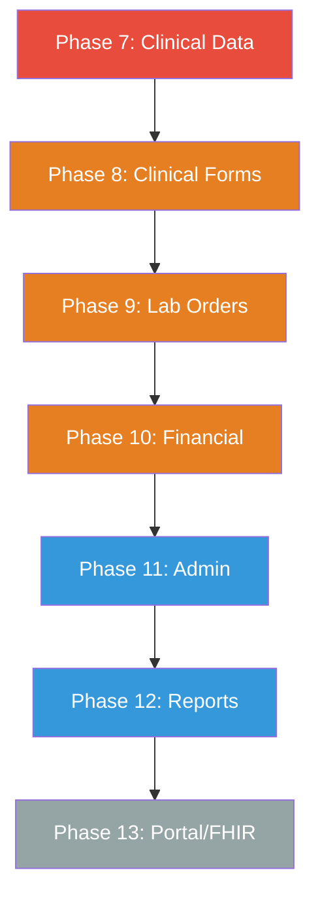

# OpenEMR Remaining Feature Migration Plan

## Current State

**Migrated:** 24 NestJS API routes, 11 React SPA pages, JWT auth
**Remaining:** 17 PHP REST controllers, 30+ PHP UI modules, 50+ reports

---

## Phase 7: Clinical Data (High Priority — Direct Patient Care)

### 7.1 Medications & ePrescribing
**PHP:** [`src/RestControllers/PrescriptionRestController.php`](src/RestControllers/PrescriptionRestController.php), [`interface/drugs/`](interface/drugs/)
**Tables:** `prescriptions`, `drugs`, `drug_inventory`
**NestJS Module:** `MedicationsModule`

| Route | Method | Description |
|-------|--------|-------------|
| `/api/patients/:pid/medications` | `GET` | ✅ Already done (Reference) |
| `/api/patients/:pid/medications` | `POST` | Create new prescription |
| `/api/patients/:pid/medications/:id` | `PUT` | Update prescription |
| `/api/patients/:pid/medications/:id` | `DELETE` | Discontinue medication |
| `/api/drugs` | `GET` | ✅ Already done (Reference) |
| `/api/drugs/:id` | `GET` | Drug detail |
| `/api/drug-inventory` | `GET` | Inventory list |
| `/api/drug-inventory/:id/dispense` | `POST` | Dispense drug |

**SPA Pages:**
- `/patients/:id/medications` — Medication list with prescribing
- `/medications` — Full ePrescribing workflow

### 7.2 Allergies
**PHP:** [`src/RestControllers/AllergyIntoleranceRestController.php`](src/RestControllers/AllergyIntoleranceRestController.php)
**Table:** `lists` (type='allergy')
**NestJS Module:** Add to `ReferenceModule`

| Route | Method | Description |
|-------|--------|-------------|
| `/api/patients/:pid/allergies` | `GET` | ✅ Already done |
| `/api/patients/:pid/allergies` | `POST` | Add allergy |
| `/api/patients/:pid/allergies/:id` | `DELETE` | Remove allergy |

### 7.3 Problems / Diagnoses
**PHP:** [`src/RestControllers/ConditionRestController.php`](src/RestControllers/ConditionRestController.php)
**Table:** `lists` (type='medical_problem')
**NestJS Module:** Add to `ReferenceModule`

| Route | Method | Description |
|-------|--------|-------------|
| `/api/patients/:pid/conditions` | `GET` | List diagnoses |
| `/api/patients/:pid/conditions` | `POST` | Add diagnosis |
| `/api/patients/:pid/conditions/:id` | `PUT` | Update |
| `/api/patients/:pid/conditions/:id` | `DELETE` | Remove |

### 7.4 Immunizations
**PHP:** [`src/RestControllers/ImmunizationRestController.php`](src/RestControllers/ImmunizationRestController.php)
**Table:** `immunizations`
**NestJS Module:** `ImmunizationsModule`

| Route | Method | Description |
|-------|--------|-------------|
| `/api/patients/:pid/immunizations` | `GET` | List immunizations |
| `/api/patients/:pid/immunizations` | `POST` | Record immunization |
| `/api/patients/:pid/immunizations/:id` | `DELETE` | Remove |

### 7.5 Vitals (Extended)
**PHP:** `interface/forms/vitals/`
**Table:** `form_vitals`
**NestJS Module:** Add to `EncountersModule`

| Route | Method | Description |
|-------|--------|-------------|
| `/api/patients/:pid/encounters/:eid/vitals` | `GET` | ✅ Done |
| `/api/patients/:pid/encounters/:eid/vitals` | `POST` | ✅ Done |
| `/api/patients/:pid/vitals` | `GET` | All vitals history |

---

## Phase 8: Clinical Forms & Notes (Medium Priority)

### 8.1 SOAP Notes (Extended)
**PHP:** `interface/forms/soap/`
**NestJS Module:** Add to `EncountersModule`

| Route | Method | Description |
|-------|--------|-------------|
| `/api/patients/:pid/encounters/:eid/soap` | `GET` | ✅ Done |
| `/api/patients/:pid/encounters/:eid/soap` | `POST` | Create SOAP note |
| `/api/patients/:pid/encounters/:eid/soap/:id` | `PUT` | Update SOAP note |

### 8.2 Clinical Forms Suite
**PHP:** `interface/forms/` (30+ form types)
**NestJS Module:** `ClinicalFormsModule`

Key forms to migrate first:
- Physical Exam (`physical_exam/`)
- Review of Systems (`ros/`)
- Review of Systems checks (`reviewofs/`)
- Clinical Notes (`clinical_notes/`)
- Care Plan (`care_plan/`)
- Treatment Plan (`treatment_plan/`)
- Transfer Summary (`transfer_summary/`)
- Procedure Order (`procedure_order/`)
- Fee Sheet (`fee_sheet/`)
- Misc Billing Options (`misc_billing_options/`)

**SPA Pages:**
- `/patients/:id/encounters/:eid/forms` — Form selector
- `/patients/:id/encounters/:eid/forms/:formType` — Individual form

---

## Phase 9: Lab Orders & Results (Medium Priority)

### 9.1 Procedure Orders (Labs/Imaging)
**PHP:** [`src/RestControllers/ProcedureRestController.php`](src/RestControllers/ProcedureRestController.php), [`interface/orders/`](interface/orders/)
**Tables:** `procedure_order`, `procedure_result`, `procedure_report`
**NestJS Module:** `ProceduresModule`

| Route | Method | Description |
|-------|--------|-------------|
| `/api/procedures` | `GET` | ✅ Done (orders list) |
| `/api/patients/:pid/procedures` | `GET` | Patient's orders |
| `/api/patients/:pid/procedures` | `POST` | New order |
| `/api/procedures/:id/results` | `GET` | Lab results |
| `/api/procedures/:id/results` | `POST` | Enter result |

**SPA Pages:**
- `/patients/:id/labs` — Lab orders and results
- `/labs/pending` — Pending results review

---

## Phase 10: Financial/Billing (Medium Priority)

### 10.1 Claims & Transactions
**PHP:** [`src/RestControllers/TransactionRestController.php`](src/RestControllers/TransactionRestController.php), [`interface/billing/`](interface/billing/)
**Tables:** `billing`, `transactions`, `claims`
**NestJS Module:** `BillingModule`

| Route | Method | Description |
|-------|--------|-------------|
| `/api/patients/:pid/billing` | `GET` | Billing summary |
| `/api/patients/:pid/transactions` | `GET` | Fee/transaction history |
| `/api/patients/:pid/transactions` | `POST` | Add charge/payment |
| `/api/claims` | `GET` | Claims list |
| `/api/claims/:id` | `GET` | Claim detail |
| `/api/claims` | `POST` | Submit claim (X12) |

**SPA Pages:**
- `/billing` — ✅ Done (dashboard)
- `/billing/claims` — Claims management
- `/patients/:id/billing` — Patient financial summary

### 10.2 Fee Sheet
**PHP:** `interface/forms/fee_sheet/`
**NestJS Module:** Add to `BillingModule`

| Route | Method | Description |
|-------|--------|-------------|
| `/api/fee-sheet/categories` | `GET` | CPT/ICD code categories |
| `/api/fee-sheet/search` | `GET` | Search codes |
| `/api/encounters/:eid/fees` | `POST` | Add fee to encounter |

---

## Phase 11: Administrative (Lower Priority)

### 11.1 User Management
**PHP:** [`src/RestControllers/UserRestController.php`](src/RestControllers/UserRestController.php)
**Table:** `users`, `users_secure`, `gacl`
**NestJS Module:** `AdminModule`

| Route | Method | Description |
|-------|--------|-------------|
| `/api/admin/users` | `GET` | User list |
| `/api/admin/users/:id` | `GET` | User detail |
| `/api/admin/users` | `POST` | Create user |
| `/api/admin/users/:id` | `PUT` | Update user |
| `/api/admin/users/:id/password` | `PUT` | Reset password |

### 11.2 Facilities & Providers
**PHP:** [`src/RestControllers/FacilityRestController.php`](src/RestControllers/FacilityRestController.php), [`src/RestControllers/PractitionerRestController.php`](src/RestControllers/PractitionerRestController.php)
**Tables:** `facility`, `users` (providers)
**NestJS Module:** `AdminModule`

| Route | Method | Description |
|-------|--------|-------------|
| `/api/facilities` | `GET` | Facility list |
| `/api/facilities/:id` | `GET` | Facility detail |
| `/api/practitioners` | `GET` | Provider list |
| `/api/practitioners/:id` | `GET` | Provider detail |

### 11.3 Documents
**PHP:** [`src/RestControllers/DocumentRestController.php`](src/RestControllers/DocumentRestController.php)
**Table:** `documents`
**NestJS Module:** `DocumentsModule`

| Route | Method | Description |
|-------|--------|-------------|
| `/api/patients/:pid/documents` | `GET` | Document list |
| `/api/patients/:pid/documents` | `POST` | Upload document |
| `/api/documents/:id` | `GET` | Download document |
| `/api/documents/:id` | `DELETE` | Delete |

### 11.4 Messages
**PHP:** [`src/RestControllers/MessageRestController.php`](src/RestControllers/MessageRestController.php)
**Table:** `pnotes`
**NestJS Module:** `MessagesModule`

| Route | Method | Description |
|-------|--------|-------------|
| `/api/messages` | `GET` | Inbox |
| `/api/messages/sent` | `GET` | Sent |
| `/api/messages` | `POST` | Send message |
| `/api/messages/:id` | `PUT` | Mark read |
| `/api/messages/:id` | `DELETE` | Delete |

---

## Phase 12: Reports & Analytics (Lower Priority)

**PHP:** `interface/reports/` (50+ reports)
**NestJS Module:** `ReportsModule`

Priority reports to migrate:

| Report | PHP File | Endpoint |
|--------|----------|----------|
| Appointments | [`appointments_report.php`](interface/reports/appointments_report.php) | `/api/reports/appointments` |
| Encounters | [`encounters_report.php`](interface/reports/encounters_report.php) | `/api/reports/encounters` |
| Clinical | [`clinical_reports.php`](interface/reports/clinical_reports.php) | `/api/reports/clinical` |
| Financial | [`svc_code_financial_report.php`](interface/reports/svc_code_financial_report.php) | `/api/reports/financial` |
| Prescriptions | [`prescriptions_report.php`](interface/reports/prescriptions_report.php) | `/api/reports/prescriptions` |
| Immunizations | [`immunization_report.php`](interface/reports/immunization_report.php) | `/api/reports/immunizations` |
| Patient List | [`patient_list.php`](interface/reports/patient_list.php) | `/api/reports/patients` |
| Collections | [`collections_report.php`](interface/reports/collections_report.php) | `/api/reports/collections` |
| Inventory | [`inventory_list.php`](interface/reports/inventory_list.php) | `/api/reports/inventory` |

**SPA Pages:**
- `/reports` — ✅ Done (appointments)
- `/reports/clinical` — Clinical reports
- `/reports/financial` — Financial reports
- `/reports/operations` — Practice operations

---

## Phase 13: Portal & FHIR (Future)

### 13.1 Patient Portal
**PHP:** [`portal/`](portal/)
**NestJS Module:** `PortalModule`

- Patient self-registration
- Appointment booking
- Prescription refill requests
- Lab result viewing
- Secure messaging
- Demographics update

### 13.2 FHIR API
**PHP:** [`src/RestControllers/FHIR/`](src/RestControllers/FHIR/)
**NestJS Module:** `FhirModule`

- `Patient`, `Observation`, `Condition`, `MedicationRequest`
- `Immunization`, `AllergyIntolerance`, `Procedure`
- `DocumentReference`, `Encounter`, `Appointment`

---

## Migration Priority Summary

| Phase | Priority | New Routes | New SPA Pages | Effort |
|-------|----------|------------|---------------|--------|
| 7: Clinical Data | 🔴 High | ~20 | 3-4 | Large |
| 8: Clinical Forms | 🟠 Medium | ~30 | 3-4 | Large |
| 9: Lab Orders | 🟠 Medium | ~8 | 2 | Medium |
| 10: Financial | 🟠 Medium | ~12 | 2 | Medium |
| 11: Admin | 🔵 Lower | ~15 | 2 | Small |
| 12: Reports | 🔵 Lower | ~10 | 3 | Small |
| 13: Portal/FHIR | ⚪ Future | ~30 | Portal SPA | Very Large |

### Approach Per Module

Each NestJS module follows the established pattern:
1. **Service** — [`*.service.ts`](backend/src/patients/patients.service.ts) with raw SQL via `@InjectDataSource()`
2. **Controller** — [`*.controller.ts`](backend/src/patients/patients.controller.ts) with `@UseGuards(JwtAuthGuard)`
3. **Module** — [`*.module.ts`](backend/src/patients/patients.module.ts) registering controller + service
4. **SPA endpoints** — [`interface/new/src/api/endpoints/*.ts`](interface/new/src/api/endpoints/) using `nestClient`
5. **React pages** — [`interface/new/src/features/*/`](interface/new/src/features/) using the established component patterns
